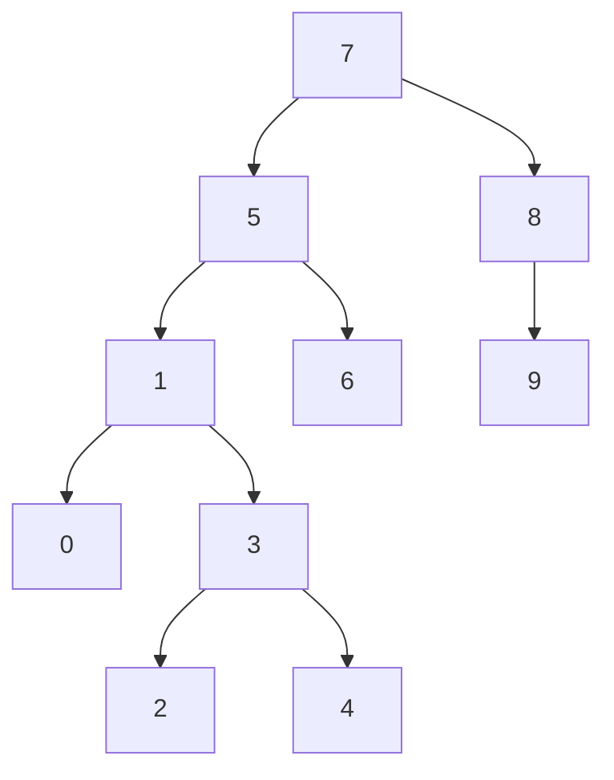

# Binary-Search-Tree-Project
I solved Binary Search Tree question in this project [Thanks to](https://patika.dev)

---

`[7, 5, 1, 8, 3, 6, 0, 9, 4, 2]`

---

## Q-Write the Binary Search Tree stages of the above given sequence.

***First number 7 is chosen as root.***
 
1) 5 on the left, 8 on the right.
2) 5 has 1 to its left and 6 to its right.
3) 1 has 0 to the left and 3 to the right.
4) 3 has 2 to the left and 4 to the right.
5) 8 is 9 to the right.

